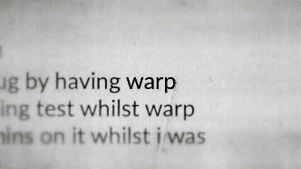

# Quick Cuts

A Python tool that automatically aligns and centers specific words in images using OCR.

Perfect for creating that "busy" effect in documentary-style videos.



## Features

- 🔍 **OCR-powered word detection** - Automatically finds target words in images
- 🎯 **Automatic centering** - Centers the detected word in the output frame
- 📐 **Consistent sizing** - Maintains uniform word size across all images
- ⚡ **Parallel processing** - Processes multiple images simultaneously for speed
- 🔤 **Partial matching** - Optionally match partial words (e.g., "warp" matches "warpdotdev")
- 📁 **Batch processing** - Process entire folders of images at once

## Installation

### Prerequisites

1. Python 3.8 or higher
2. [Tesseract OCR](https://github.com/tesseract-ocr/tesseract) installed on your system
   - **Windows**: Download installer from [GitHub releases](https://github.com/UB-Mannheim/tesseract/wiki)
   - **Mac**: `brew install tesseract`
   - **Linux**: `sudo apt-get install tesseract-ocr`

### Using uv (Recommended)

```bash
# Clone the repository
git clone https://github.com/yourusername/quick-cuts.git
cd quick-cuts

# Install dependencies with uv
uv pip install -r requirements.txt
```

### Using pip

```bash
# Clone the repository
git clone https://github.com/yourusername/quick-cuts.git
cd quick-cuts

# Install dependencies
pip install -r requirements.txt
```

## Usage

### Basic Usage

Process images with a specific word:

```bash
python quick_cuts.py images/*.png -w "breaking"
```

### Examples

**Process a folder with partial matching:**
```bash
python quick_cuts.py images/ -w "warp" --partial
```

**Custom output size and word height:**
```bash
python quick_cuts.py images/*.jpg -w "news" -s 1920x1080 --word-height 150
```

**Specify output directory:**
```bash
python quick_cuts.py images/ -w "alert" -o output_folder
```

**Use multiple workers for faster processing:**
```bash
python quick_cuts.py images/ -w "update" --workers 8
```

### Command Line Options

| Option | Description | Default |
|--------|-------------|---------|
| `images` | Input image file(s) or directory | Required |
| `-w, --word` | Target word to center | Required |
| `-o, --output` | Output directory | `./aligned_[word]` |
| `-s, --size` | Output image size | `1920x1080` |
| `--word-height` | Target height for word in pixels | `100` |
| `--partial` | Enable partial word matching | `False` |
| `--workers` | Number of parallel workers | CPU count |
| `--background` | Background color (white/black/transparent) | `white` |

## How It Works

1. **OCR Detection**: The tool uses Tesseract OCR to detect text in each image
2. **Word Location**: Finds the target word and its bounding box
3. **Alignment Calculation**: Calculates the transformation needed to center the word
4. **Image Generation**: Creates a new image with the word perfectly centered
5. **Batch Processing**: Processes all images in parallel for efficiency

## Output

The tool creates aligned images with consistent properties:
- All images have the same resolution
- Target word is centered in every frame
- Word size is consistent across all images
- Original aspect ratios are preserved where possible

Output files are saved as `aligned_[original_filename]` in the output directory.

## Tips for Best Results

1. **Image Quality**: Higher resolution images produce better OCR results
2. **Text Clarity**: Ensure text is clear and readable in source images
3. **Contrast**: Good contrast between text and background improves detection
4. **Preprocessing**: The tool automatically applies image preprocessing, but very poor quality images may still fail

## Troubleshooting

### OCR not finding words
- Ensure Tesseract is properly installed and in your PATH
- Try adjusting the confidence threshold in the code
- Check that the text is clear and readable in your images

### Unicode filename errors
- The tool handles Unicode characters in filenames automatically
- If issues persist, try renaming files to use only ASCII characters

### Performance issues
- Reduce the number of workers if you experience memory issues
- Process images in smaller batches for very large datasets

## Use Case: Video Editing

This tool is perfect for creating dynamic news-style cuts where specific words need to be emphasized:

1. Export frames from your video clips
2. Run quick_cuts to align all frames on your target word
3. Import the aligned images into Premiere/After Effects
4. Create smooth transitions between different clips with the word always centered

## License

MIT License - feel free to use this tool for any purpose!

## Contributing

Contributions are welcome! Please feel free to submit a Pull Request.

## Web Scraping (scrape_content)

New: Quick Cuts can now fetch related articles/posts for a keyword so you can keep research and creation in one place.

- Sources (no API keys required): Google News RSS, Bing News RSS, Hacker News
- Output: normalized items with fields: source, title, url, snippet, published_at

Dependencies
- Ensure these are installed (already added to requirements):
  - requests>=2.31.0
  - feedparser>=6.0.10

Quick start (Python IPC example)
```python
import json, subprocess, sys
# Start backend
p = subprocess.Popen([sys.executable, 'backend_service.py'], stdin=subprocess.PIPE, stdout=subprocess.PIPE, text=True)
print('Startup:', p.stdout.readline().strip())

# Send scrape command
cmd = {"command": "scrape_content", "query": "OpenAI", "limit": 5, "sources": ["news", "hn"]}
p.stdin.write(json.dumps(cmd) + "\n"); p.stdin.flush()
print('Response:', p.stdout.readline().strip())

# Shutdown backend
p.stdin.write(json.dumps({"command": "shutdown"}) + "\n"); p.stdin.flush()
print('Shutdown:', p.stdout.readline().strip())
```

Command parameters
- query (string, required): keyword/phrase to search
- limit (int, optional, default 10): max items per source (1–50)
- sources (list or comma-separated string, optional):
  - "news" -> Google News + Bing News RSS
  - "hn" -> Hacker News (Algolia)

Notes
- The backend will reply with an error if dependencies are missing.
- Network calls use timeouts; some sources may occasionally fail—errors are handled per source so others can still return results.
